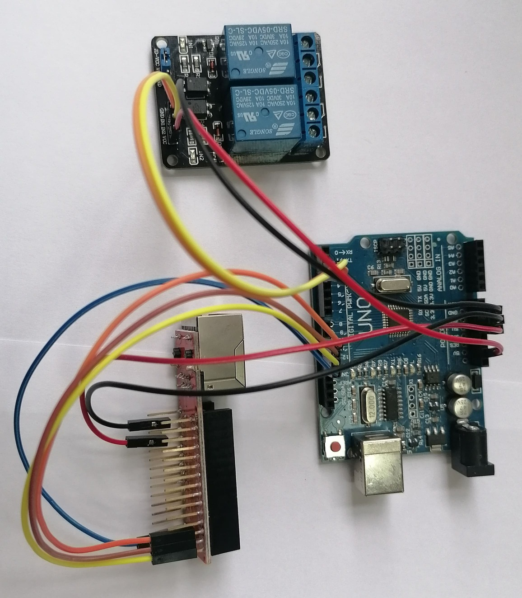
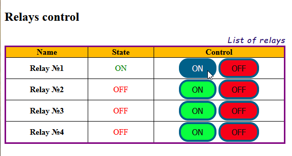
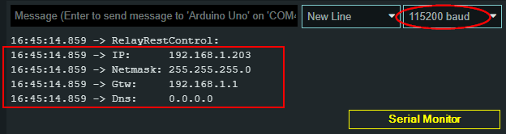

# RelayControl
**Controlling of "arduino-relay" by using web browser through ethernet.**

This project is designed for Arduino which performs the functions of ethernet relay witch controlled by using web-browser. Number of outputs is 4.

#### Possibilities:
- switching on/off the relay;
- display of their status;

#### Requirements
- Arduino Uno/Nano shield;
- Ethernet Shield on ECN28J60 for Arduino Nano;

#### Wiring diagram:

Number| Device   |  PIN  | Device   |  PIN  | Color
------|:---------|:------|:---------|:------|:------
1	  |  UNO   	 |  D13  | ENC28J60 | D13   | синий
2	  |  UNO   	 |  D12  | ENC28J60 | D12   | желтый
3	  |  UNO   	 |  D11  | ENC28J60 | D11   | коричневый
4	  |  UNO   	 |  D10  | ENC28J60 | D10   | оранжевый
5	  |  UNO   	 |  5V   | ENC28J60 | 5V   | красный
6	  |  UNO   	 |  GND  | ENC28J60 | GND   | черный
7	  |  UNO   	 |  D2  | Relay | D11   | желтый
8	  |  UNO   	 |  D3  | Relay | D10   | оранжевый
9	  |  UNO   	 |  5V   | Relay | VCC  | красный
10	  |  UNO   	 |  GND  | Relay | GND   | черный

This project consists from two parts:
- arduino:
	- IDE: Arduion IDE 2.0.3;
	- libraries:
        - aREST by Marco Schwartz v.2.9.7
        - EtherCard by Jean-Claude Wippler v1.1.0
	- Project: RelayRestControl.ino;
- html/js web client;

## Arduino

**Communication:**

**REST API:**
Request:
~~~bash
	http://192.168.1.203/relay1?params=1	// switch on Relay #1
	http://192.168.1.203/relay1?params=0	// switch off Relay #1
	http://192.168.1.203/relay1		// get info about Relay #1 without switching
						// possible relay values: relay1 .. relay4
~~~
Response (JSON)
~~~bash
{"return_value": 0, "id": "1", "name": "Computer", "hardware": "arduino", "connected": true}
~~~
